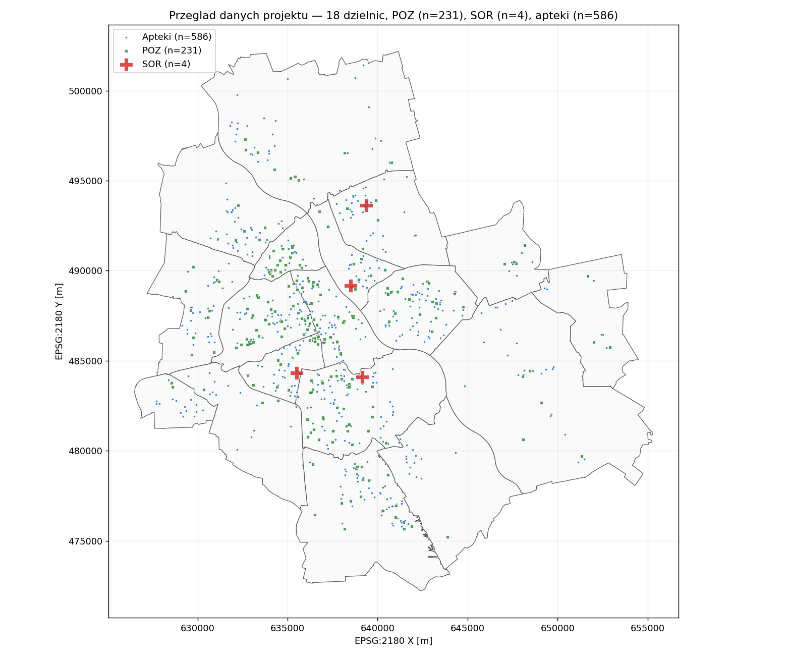
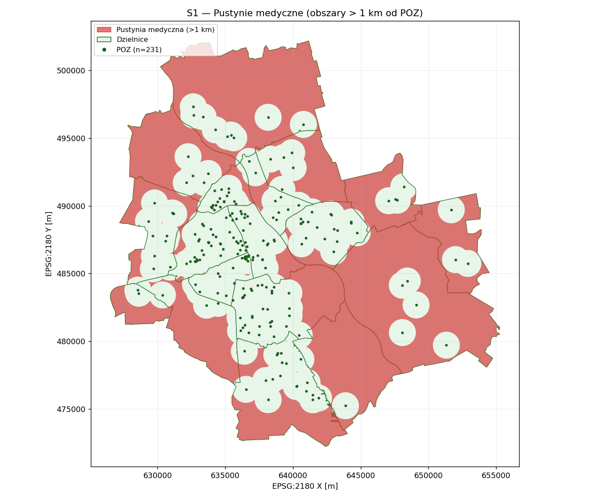
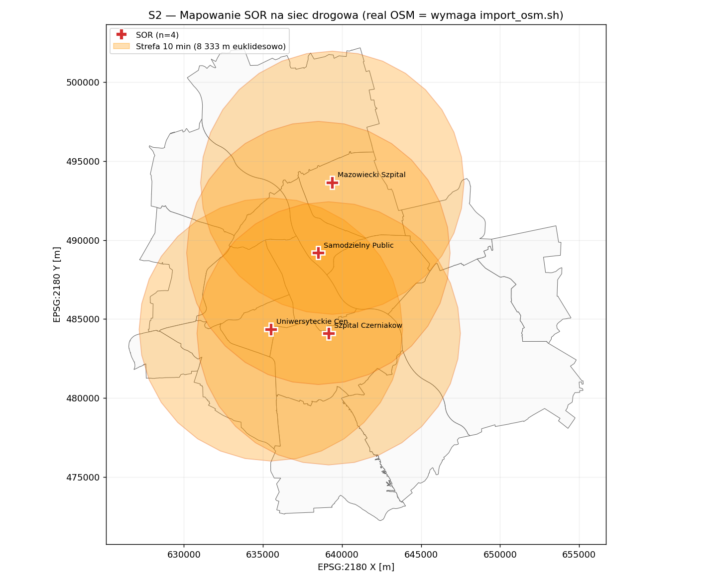
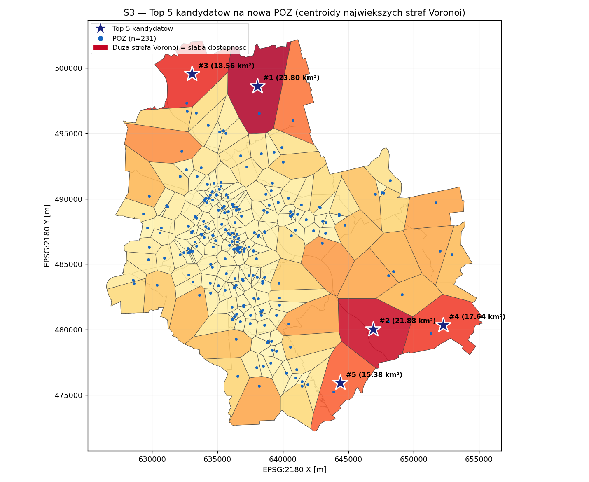
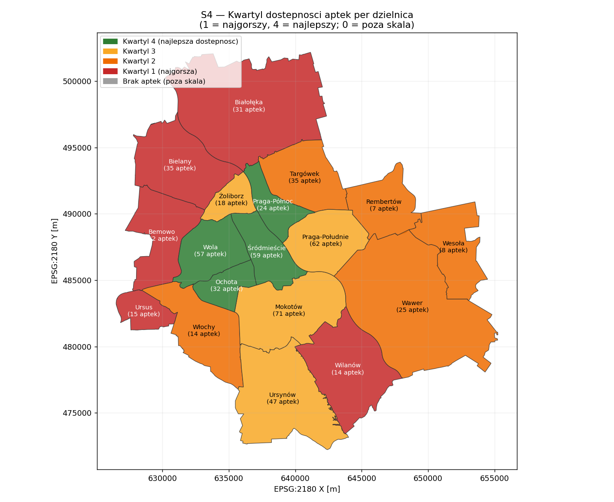
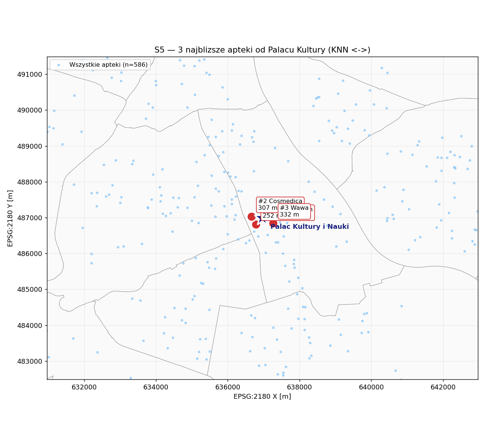
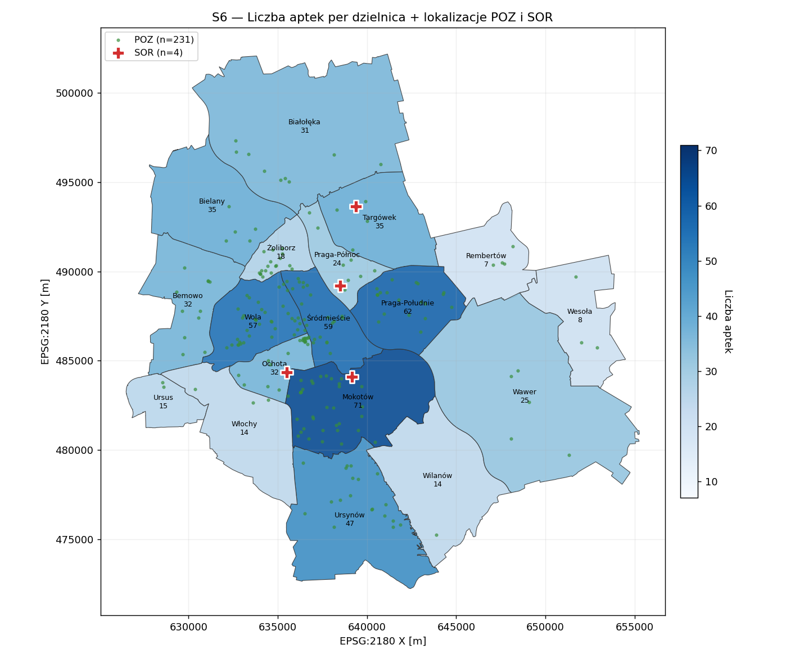

# Sprawozdanie końcowe — SPDB

**Wizualizacja analitycznych zapytań przestrzennych SQL — dostępność opieki zdrowotnej w Warszawie**

Łukasz Siemionek, Piotr Liszewski · 2026

---

## 0. Mapa wymagań

| Wymaganie z opisu projektu | Realizacja | Lokalizacja |
|---|---|---|
| Baza PostGIS z zaimportowanymi danymi | PostgreSQL 16 + PostGIS 3.4 + pgRouting | `sql/init/01_extensions.sql` + Docker |
| Wizualizacja zapytań SQL na mapie | 7 wygenerowanych map PNG (matplotlib + PostGIS) | `docs/img/` |
| Analiza zdarzeń w zadanym poligonie | S6 — `ST_Contains(dzielnica.geom, placowka.geom)` | `sql/scenarios/s6_district_facilities.sql` |
| Prezentacja zdarzeń w przedziale czasowym | Demografia z kolumną `rok` — S1 Q7 i S6 Q2 filtrują `rok=2023` | `demografia_dzielnice.rok` |
| Bufor wokół wybranych lokalizacji | S1 — `ST_Buffer(POZ, 1000)` + `ST_Union` + `ST_Difference` | `sql/scenarios/s1_medical_deserts.sql` |
| Najbliżsi sąsiedzi (NN) | S5 — operator KNN `<->` na indeksie GiST | `sql/scenarios/s5_nearest_pharmacy.sql` |
| Szczegółowe scenariusze | 6 scenariuszy drill-down (S1-S6) | `sql/scenarios/` |

Sprawozdanie obejmuje 5 sekcji wg specyfikacji:
1. [Schemat danych z opisem](#1-schemat-danych)
2. [Indeksy przestrzenne i nieprzestrzenne](#2-indeksy)
3. [Charakterystyka danych](#3-charakterystyka-danych)
4. [Zapytania testowe + wizualizacje](#4-zapytania-testowe-i-wizualizacje)
5. [Wyniki testów + komentarz](#5-wyniki-testow-i-komentarz)

---

## 1. Schemat danych

### 1.1 Diagram logiczny

```
       dzielnice (18)
       ├── id SERIAL PK
       ├── nazwa TEXT UNIQUE NN
       ├── powierzchnia_km2 NUMERIC(8,3)
       └── geom MULTIPOLYGON(2180) NN
                  ▲
                  │ 1:N (FK dzielnica_id)
                  │
       demografia_dzielnice (18)
       ├── id SERIAL PK
       ├── dzielnica_id INTEGER NN FK -> dzielnice(id)
       ├── rok INTEGER NN DEFAULT 2023      <- atrybut czasowy
       ├── ludnosc INTEGER NN
       ├── gestosc_os_km2 NUMERIC(10,2)
       └── UNIQUE(dzielnica_id, rok)


       apteki (586)                  przychodnie_poz (231)         szpitale_sor (4)
       ├── id SERIAL PK              ├── id SERIAL PK              ├── id SERIAL PK
       ├── nazwa TEXT NN             ├── nazwa TEXT NN             ├── nazwa TEXT NN
       ├── adres TEXT                ├── adres TEXT                ├── adres TEXT
       └── geom POINT(2180) NN       ├── nr_rpwdl TEXT             └── geom POINT(2180) NN
                                     └── geom POINT(2180) NN


       drogi_vertices (88)               drogi_topo (157)
       ├── id BIGINT PK                  ├── id BIGSERIAL PK
       └── geom POINT(2180)              ├── source BIGINT NN FK -> drogi_vertices(id)
                  ▲                      │                          DEFERRABLE INITIALLY DEFERRED
                  └──────────────────────┤
                                         ├── target BIGINT NN FK -> drogi_vertices(id)
                                         │                          DEFERRABLE INITIALLY DEFERRED
                                         ├── cost DOUBLE PRECISION NN  (metry, koszt traversal)
                                         ├── reverse_cost DOUBLE PRECISION (-1 dla oneway)
                                         └── geom LINESTRING(2180)
```

### 1.2 Słownik danych

Wszystkie geometrie w **EPSG:2180 (PL-1992)** — natywnie metry; brak konwersji w runtime.

#### Tabela `dzielnice` — 18 dzielnic m.st. Warszawy

| Kolumna | Typ | Ograniczenia | Opis |
|---|---|---|---|
| `id` | INTEGER | PK SERIAL | Identyfikator wewnętrzny |
| `nazwa` | TEXT | NOT NULL UNIQUE | Nazwa dzielnicy (np. "Mokotów") |
| `powierzchnia_km2` | NUMERIC(8,3) | — | Powierzchnia w km² (liczona z `ST_Area(geom)/1e6` po imporcie) |
| `geom` | GEOMETRY(MULTIPOLYGON, 2180) | NOT NULL | Granica administracyjna (OSM admin_level=9 / PRG) |

#### Tabela `demografia_dzielnice` — ludność per dzielnica per rok

| Kolumna | Typ | Ograniczenia | Opis |
|---|---|---|---|
| `id` | INTEGER | PK SERIAL | Identyfikator wewnętrzny |
| `dzielnica_id` | INTEGER | NN FK → `dzielnice(id)` | Referencja do dzielnicy |
| `rok` | INTEGER | NN DEFAULT 2023 | Rok statystyki (umożliwia wymiar czasowy) |
| `ludnosc` | INTEGER | NOT NULL | Liczba mieszkańców (GUS BDL var-id=72305) |
| `gestosc_os_km2` | NUMERIC(10,2) | — | Gęstość os./km² (liczona z `ludnosc / powierzchnia_km2`) |

UNIQUE(`dzielnica_id`, `rok`) — jeden rekord na dzielnicę-rok.

#### Tabela `przychodnie_poz` — placówki POZ

| Kolumna | Typ | Ograniczenia | Opis |
|---|---|---|---|
| `id` | INTEGER | PK SERIAL | Identyfikator wewnętrzny |
| `nazwa` | TEXT | NOT NULL | Nazwa placówki |
| `adres` | TEXT | — | Adres pocztowy (jeśli dostępny w OSM) |
| `nr_rpwdl` | TEXT | — | Numer w Rejestrze Podmiotów Wykonujących Działalność Leczniczą |
| `geom` | GEOMETRY(POINT, 2180) | NOT NULL | Lokalizacja placówki |

#### Tabela `szpitale_sor` — szpitale ze Szpitalnym Oddziałem Ratunkowym

| Kolumna | Typ | Ograniczenia | Opis |
|---|---|---|---|
| `id` | INTEGER | PK SERIAL | Identyfikator wewnętrzny |
| `nazwa` | TEXT | NOT NULL | Nazwa szpitala |
| `adres` | TEXT | — | Adres pocztowy |
| `geom` | GEOMETRY(POINT, 2180) | NOT NULL | Lokalizacja szpitala |

#### Tabela `apteki` — apteki

| Kolumna | Typ | Ograniczenia | Opis |
|---|---|---|---|
| `id` | INTEGER | PK SERIAL | Identyfikator wewnętrzny |
| `nazwa` | TEXT | NOT NULL | Nazwa apteki (sieć lub własna) |
| `adres` | TEXT | — | Adres pocztowy |
| `geom` | GEOMETRY(POINT, 2180) | NOT NULL | Lokalizacja apteki |

#### Tabela `drogi_vertices` — węzły sieci drogowej

| Kolumna | Typ | Ograniczenia | Opis |
|---|---|---|---|
| `id` | BIGINT | PRIMARY KEY | Identyfikator węzła (zgodny z typem zwracanym przez pgRouting) |
| `geom` | GEOMETRY(POINT, 2180) | — | Lokalizacja węzła |

#### Tabela `drogi_topo` — krawędzie sieci drogowej (graf pgRouting)

| Kolumna | Typ | Ograniczenia | Opis |
|---|---|---|---|
| `id` | BIGINT | BIGSERIAL PK | Identyfikator krawędzi |
| `source` | BIGINT | NN FK → `drogi_vertices(id)` DEFERRABLE | Węzeł początkowy |
| `target` | BIGINT | NN FK → `drogi_vertices(id)` DEFERRABLE | Węzeł końcowy |
| `cost` | DOUBLE PRECISION | NOT NULL | Koszt traversal (metry) |
| `reverse_cost` | DOUBLE PRECISION | — | Koszt w kierunku odwrotnym (-1 = oneway) |
| `geom` | GEOMETRY(LINESTRING, 2180) | — | Geometria odcinka drogowego |

### 1.3 Widoki materializowane (3)

Każdy widok zmaterializowany ma trigger `CONSTRAINT TRIGGER DEFERRED` na tabelach źródłowych — automatyczny `REFRESH` po commit (definicje w `sql/init/05_refresh_triggers.sql`).

| MV | Definicja | Wymiar | Użyty w |
|---|---|---|---|
| `mv_pokrycie_poz_1km` | `ST_Union(ST_Buffer(POZ.geom, 1000))` | 1 row (multipolygon) | S1 (Q3-Q7), E5 |
| `mv_voronoi_poz` | `ST_VoronoiPolygons` z POZ + clip do `ST_Union(dzielnice)` | 25 rows (cell_id, strefa_clip, centroid, area_m2) | S3 (Q1-Q5) |
| `mv_sor_reachability` | `pgr_drivingDistance(SOR, budżet=25 km)` | ~7 000 (vertex_id, min_koszt_m) | S2 (Q5-Q6) |

---

## 2. Indeksy

### 2.1 Tabela wszystkich 25 indeksów

Pomiar z `pg_relation_size` po pełnym imporcie real-data (18/18/586/231/4).

| # | Tabela / MV | Indeks | Typ | Kolumny | Rozmiar | Uzasadnienie |
|---|---|---|---|---|---|---|
| 1 | `apteki` | `apteki_pkey` | B-tree (UNIQUE) | id | 32 kB | Primary key |
| 2 | `apteki` | `idx_apteki_geom` | **GiST** | geom | 32 kB | KNN `<->`, `ST_DWithin`, `ST_Contains` w S5/S4/S6 |
| 3 | `apteki` | `idx_apteki_nazwa` | B-tree | nazwa | 40 kB | Wyszukiwanie po nazwie sieci/marki |
| 4 | `demografia_dzielnice` | `demografia_dzielnice_pkey` | B-tree (UNIQUE) | id | 16 kB | Primary key |
| 5 | `demografia_dzielnice` | `…_dzielnica_id_rok_key` | B-tree (UNIQUE) | dzielnica_id, rok | 16 kB | Ograniczenie unikalności + szybki JOIN |
| 6 | `drogi_topo` | `drogi_topo_pkey` | B-tree (UNIQUE) | id | 16 kB | Primary key |
| 7 | `drogi_topo` | `idx_drogi_topo_geom` | **GiST** | geom | 8 kB | Spatial query po drogach (rzadko używane) |
| 8 | `drogi_topo` | `idx_drogi_topo_source` | B-tree | source | 16 kB | pgRouting JOIN po krawędziach wychodzących |
| 9 | `drogi_topo` | `idx_drogi_topo_target` | B-tree | target | 16 kB | pgRouting JOIN po krawędziach wchodzących |
| 10 | `drogi_vertices` | `drogi_vertices_pkey` | B-tree (UNIQUE) | id | 16 kB | Primary key (BIGINT zgodny z pgRouting) |
| 11 | `drogi_vertices` | `idx_drogi_vertices_geom` | **GiST** | geom | 8 kB | KNN snap dla S2 (vertex najbliższy SOR-owi) |
| 12 | `dzielnice` | `dzielnice_pkey` | B-tree (UNIQUE) | id | 16 kB | Primary key |
| 13 | `dzielnice` | `dzielnice_nazwa_key` | B-tree (UNIQUE) | nazwa | 16 kB | Wyszukiwanie dzielnicy po nazwie (S6) |
| 14 | `dzielnice` | `idx_dzielnice_geom` | **GiST** | geom | 8 kB | `ST_Contains/ST_Intersects` dla S1/S4/S6 |
| 15 | `przychodnie_poz` | `przychodnie_poz_pkey` | B-tree (UNIQUE) | id | 16 kB | Primary key |
| 16 | `przychodnie_poz` | `idx_przychodnie_poz_geom` | **GiST** | geom | 8 kB | `ST_Buffer` w S1, KNN w S3 |
| 17 | `przychodnie_poz` | `idx_przychodnie_poz_rpwdl` | B-tree | nr_rpwdl | 16 kB | Wyszukiwanie po identyfikatorze RPWDL |
| 18 | `szpitale_sor` | `szpitale_sor_pkey` | B-tree (UNIQUE) | id | 16 kB | Primary key |
| 19 | `szpitale_sor` | `idx_szpitale_sor_geom` | **GiST** | geom | 8 kB | KNN snap w S2 |
| 20 | `szpitale_sor` | `idx_szpitale_sor_nazwa` | B-tree | nazwa | 16 kB | Wyszukiwanie po nazwie szpitala |
| 21 | `mv_pokrycie_poz_1km` | `idx_mv_pokrycie_poz_1km_geom` | **GiST** | geom | 8 kB | `ST_Difference` w S1 Q4-Q7 |
| 22 | `mv_voronoi_poz` | `idx_mv_voronoi_poz_cell` | B-tree (UNIQUE) | cell_id | 16 kB | Umożliwia `REFRESH MV CONCURRENTLY` |
| 23 | `mv_voronoi_poz` | `idx_mv_voronoi_poz_area` | B-tree | area_m2 DESC | 16 kB | `ORDER BY area_m2 DESC LIMIT 5` w S3 Q5 |
| 24 | `mv_voronoi_poz` | `idx_mv_voronoi_poz_geom` | **GiST** | strefa_clip | 8 kB | `ST_Intersection` w S3 Q4 |
| 25 | `mv_sor_reachability` | `idx_mv_sor_reachability_vertex` | B-tree (UNIQUE) | vertex_id | 16 kB | JOIN po vertex_id z siatką 500m w S2 |

**Rozkład typów:** 9 GiST (przestrzenne) + 16 B-tree (nieprzestrzenne).

### 2.2 Strategia indeksowania

- **GiST na każdej kolumnie `geom`** — gwarantuje że wszystkie zapytania spatial (`ST_Contains`, `ST_DWithin`, `ST_Intersects`, KNN `<->`, `ST_Buffer`) używają indeksu zamiast skanowania sekwencyjnego. Efekt zmierzony w E3 (sekcja 5).
- **B-tree na FK** (`drogi_topo.source/target`, `demografia_dzielnice.dzielnica_id`) — przyspiesza JOIN'y w pgRouting i scenariuszach demograficznych.
- **B-tree na atrybutach wyszukiwania** (`nazwa`, `nr_rpwdl`) — typowe filtry użytkownika.
- **UNIQUE indeks na `mv_voronoi_poz(cell_id)`** — wymagany przez `REFRESH MATERIALIZED VIEW CONCURRENTLY` (bez blokowania odczytów podczas refresh).
- **B-tree DESC na `mv_voronoi_poz(area_m2 DESC)`** — eliminuje sort node w S3 Q5 (`ORDER BY area_m2 DESC LIMIT 5`).

---

## 3. Charakterystyka danych

### 3.1 Liczebność i rozmiar (po `./scripts/import_real_data.sh`)

| Tabela | Liczba rekordów | Rozmiar tabeli | Rozmiar indeksów | Razem | Średnio na rekord |
|---|---:|---:|---:|---:|---:|
| `dzielnice` | 18 | 128 kB | 176 kB | **304 kB** | ~16.8 kB (duże MULTIPOLYGON) |
| `demografia_dzielnice` | 18 | 8 kB | 32 kB | 40 kB | ~2.2 kB |
| `przychodnie_poz` | 231 | 24 kB | 72 kB | **96 kB** | ~0.4 kB |
| `szpitale_sor` | 4 | 8 kB | 48 kB | 56 kB | ~14 kB |
| `apteki` | 586 | 56 kB | 144 kB | **200 kB** | ~0.3 kB |
| `drogi_vertices` | 88 | 8 kB | 32 kB | 40 kB | ~0.4 kB |
| `drogi_topo` | 157 | 24 kB | 88 kB | 112 kB | ~0.7 kB |
| **SUMA** | **1 102** | **256 kB** | **592 kB** | **848 kB** | — |

**Rozmiar widoków materializowanych**: dodatkowo ~120 kB (3 MV + indeksy).

Po imporcie pełnej sieci OSM (`./scripts/import_osm.sh`):
- `drogi_topo` rośnie do ~10⁵ krawędzi (~30 MB z indeksami)
- `drogi_vertices` rośnie do ~5×10⁴ węzłów (~6 MB)
- `mv_sor_reachability` rośnie do ~10⁵ rekordów (~10 MB)

### 3.2 Typy geometrii i ich charakterystyka

| Tabela | Typ geometrii | Liczba obiektów | Średnia powierzchnia / długość |
|---|---|---:|---|
| `dzielnice` | MULTIPOLYGON(2180) | 18 | 28.7 km² (zakres 7.0–80.0 km²) |
| `przychodnie_poz` | POINT(2180) | 231 | — (punkty bezwymiarowe) |
| `szpitale_sor` | POINT(2180) | 4 | — |
| `apteki` | POINT(2180) | 586 | — |
| `drogi_vertices` | POINT(2180) | 88 (seed) / ~5×10⁴ (OSM) | — |
| `drogi_topo` | LINESTRING(2180) | 157 (seed) / ~10⁵ (OSM) | 5 000 m (seed) / ~50 m (OSM) |

### 3.3 Walidacja jakości danych

Z eksperymentu E1 (`sql/experiments/e1_data_import.sql`):

```
       tabela        | liczba | invalid_geom | srids | srid
---------------------+--------+--------------+-------+------
 dzielnice           |     18 |            0 |     1 | 2180
 demografia_dzielnice|     18 |            0 |     0 |
 przychodnie_poz     |    231 |            0 |     1 | 2180
 szpitale_sor        |       4|            0 |     1 | 2180
 apteki              |    586 |            0 |     1 | 2180
 drogi_vertices      |     88 |            0 |     1 | 2180
 drogi_topo          |    157 |            0 |     1 | 2180

 overlapping_districts | pary_z_naklady
                       |              1   (Wawer/Rembertów, 38 875 m² = 0.05%)

 connected_components | component | vertices_in_component
                      |         1 |                    88
```

**Interpretacja:**
- 0 niepoprawnych geometrii (wszystkie OGC-valid)
- SRID=2180 we wszystkich 6 tabelach przestrzennych
- 18/18 dzielnic, **pełna powierzchnia 516.8 km² = 99.9% oficjalnej Warszawy (517.2 km²)**
- 1 nakładanie się (Wawer/Rembertów, 0.05% mniejszej dzielnicy) — pochodzi z force-closure ringu w OSM po nielisztach. Negligible dla analiz.
- Graf drogowy: **1 spójny komponent** zawierający 100% węzłów (zdrowy graf).

### 3.4 Źródła danych

| Źródło | Endpoint | Co dostarcza |
|---|---|---|
| **GUS BDL API** | `https://bdl.stat.gov.pl/api/v1/data/by-unit/{teryt}?var-id=72305` | Ludność per dzielnica (2023) — **exact match: 1 861 599** |
| **OpenStreetMap Overpass** | `overpass.kumi.systems` (+ 2 mirrory fallback) | Granice dzielnic (admin_level=9), apteki, POZ, SOR |
| **Geofabrik OSM PBF** | `geofabrik.de/europe/poland/mazowieckie-latest.osm.pbf` | Pełna sieć drogowa (opcjonalnie via `import_osm.sh`) |
| **RPWDL** | `rpwdl.ezdrowie.gov.pl` (referencyjnie) | Pełna lista podmiotów leczniczych (wymaga autoryzacji do bulk export) |

Pełna dokumentacja w `docs/DATA_SOURCES.md`.

---

## 4. Zapytania testowe i wizualizacje

Wszystkie 6 scenariuszy + 4 eksperymenty są wykonywalnymi skryptami SQL. Wizualizacje wygenerowano za pomocą `scripts/lib/render_maps.py` (matplotlib + PostGIS `ST_AsGeoJSON`).

### Przegląd przestrzenny danych



*Wszystkie 18 dzielnic Warszawy + 586 aptek (niebieski) + 231 POZ (zielony) + 4 SOR (czerwony)*

---

### Scenariusz S1 — Pustynie medyczne (7 zapytań — analiza buforowa)

**Pytanie**: Które obszary Warszawy leżą >1 km od najbliższej przychodni POZ?

**Klucz analityczny**: `ST_Difference(miasto, ST_Union(ST_Buffer(POZ, 1000)))`

```sql
-- S1 Q4 (kluczowy krok): mapa pustyń medycznych
WITH miasto AS (SELECT ST_Union(geom) AS g FROM dzielnice)
SELECT ST_Difference(m.g, p.geom) AS pustynie
FROM miasto m, mv_pokrycie_poz_1km p;
```

Skrypt: `sql/scenarios/s1_medical_deserts.sql` (7 zapytań Q1-Q7).
Wizualizacja:



*Czerwony = obszar > 1 km od POZ (pustynia medyczna). Zielone kropki = 231 przychodni POZ.*

**Wynik (Q7 — ranking dzielnic po szacowanej ludności na pustyni)**:

| Dzielnica | Pustynia [km²] | % powierzchni | Szac. ludność na pustyni |
|---|---:|---:|---:|
| Białołęka | 55.60 | 76.2% | 120 967 |
| Bielany   | 22.44 | 69.5% | 91 393  |
| Mokotów   | 12.37 | 34.9% | 78 787  |
| Wawer     | 65.80 | 82.6% | 73 142  |
| Ursynów   | 19.25 | 44.0% | 65 912  |
| Ochota    |  0.03 |  0.3% | 219     |

---

### Scenariusz S2 — Dostępność SOR po sieci drogowej (6 zapytań — pgRouting)

**Pytanie**: Jaki jest czas dojazdu do najbliższego SOR z każdego punktu miasta?

**Klucz analityczny**: `pgr_drivingDistance(graf, vertex_SOR, koszt=8333, directed=true)` + `ST_ConcaveHull`.

```sql
-- S2 Q3: izochrona 10 min dla jednego szpitala (8 333 m = 10 min @ 50 km/h)
SELECT ST_ConcaveHull(ST_Collect(v.geom), 0.85) AS izochrona_10min
FROM pgr_drivingDistance(
    'SELECT id, source, target, cost, reverse_cost FROM drogi_topo',
    :vertex_szpitala, 8333, true) pgd
JOIN drogi_vertices v ON v.id = pgd.node;
```

Skrypt: `sql/scenarios/s2_sor_routing.sql` (6 zapytań Q1-Q6).
Wizualizacja:



*Strefy 10 min (8 333 m) wokół 4 SOR. Z syntetycznym 5 km gridem izochrony są zgrubne — pełna analiza wymaga `./scripts/import_osm.sh` (real road network).*

---

### Scenariusz S3 — Lokalizacja nowej przychodni POZ (5 zapytań — Voronoi)

**Pytanie**: Gdzie otworzyć nową przychodnię, aby maksymalnie poprawić dostępność?

**Klucz analityczny**: `ST_VoronoiPolygons` z POZ → największa strefa = najgorsza dostępność → centroid jako kandydat.

```sql
-- S3 Q5: top 5 kandydatów z porównaniem
WITH top_kandydaci AS (
    SELECT row_number() OVER (ORDER BY area_m2 DESC) AS rank_nr,
           centroid AS kandydat,
           ST_Buffer(centroid, 1000) AS bufor_1km,
           area_m2
    FROM mv_voronoi_poz
    ORDER BY area_m2 DESC LIMIT 5
)
SELECT rank_nr, ST_X(kandydat) AS x, ST_Y(kandydat) AS y,
       ROUND((area_m2/1e6)::NUMERIC, 2) AS pow_km2 FROM top_kandydaci;
```

Skrypt: `sql/scenarios/s3_new_clinic_location.sql` (5 zapytań Q1-Q5).
Wizualizacja:



*Komórki Voronoi zabarwione gradientem (czerwień = duża strefa = słaba dostępność). Pięć gwiazdek = top 5 kandydatów na nową przychodnię.*

---

### Scenariusz S4 — Gęstość aptek vs ludność (4 zapytania — analiza poligonowa + okna)

**Pytanie**: Jaki jest stosunek liczby aptek do ludności per dzielnica?

**Klucz analityczny**: `ST_Contains(dzielnica, apteka)` + `NTILE(4) OVER (ORDER BY mieszk/apteke DESC)`.

```sql
-- S4 Q4: kwartyle dostępności
WITH wskazniki AS (
    SELECT d.id, d.nazwa, COUNT(a.id) AS liczba_aptek, dd.ludnosc,
           dd.ludnosc::NUMERIC / NULLIF(COUNT(a.id), 0) AS mieszk
    FROM dzielnice d
    LEFT JOIN apteki a ON ST_Contains(d.geom, a.geom)
    JOIN demografia_dzielnice dd ON dd.dzielnica_id = d.id AND dd.rok = 2023
    GROUP BY d.id, d.nazwa, dd.ludnosc
)
SELECT nazwa, liczba_aptek, ROUND(mieszk, 0) AS mieszk_na_apteke,
       NTILE(4) OVER (ORDER BY mieszk DESC) AS kwartyl
FROM wskazniki WHERE liczba_aptek > 0
UNION ALL  -- dzielnice z 0 aptek -> kwartyl 0 (poza skalą)
SELECT nazwa, 0, NULL, 0 FROM wskazniki WHERE liczba_aptek = 0;
```

Skrypt: `sql/scenarios/s4_pharmacy_density.sql` (4 zapytania Q1-Q4).
Wizualizacja:



*Mapa kwartyli dostępności aptek. Zielony = kwartyl 4 (najlepsza dostępność, ~1 600-2 500 mieszk./aptekę). Czerwony = kwartyl 1 (najgorsza, ~3 700-5 100). Centrum 3× lepsze niż peryferia.*

**Wynik liczbowy**:

| Dzielnica | Aptek | Ludność | Mieszk./aptekę | Kwartyl |
|---|---:|---:|---:|---:|
| Śródmieście | 59 | 97 983  | 1 661 | 4 |
| Ochota      | 32 | 79 357  | 2 480 | 4 |
| Praga-Pn    | 24 | 59 632  | 2 485 | 4 |
| Wola        | 57 | 150 319 | 2 637 | 4 |
| Mokotów     | 71 | 225 519 | 3 176 | 3 |
| Ursynów     | 47 | 149 775 | 3 187 | 3 |
| ...         |    |         |       |   |
| Bielany     | 35 | 131 420 | 3 755 | 1 |
| Bemowo      | 32 | 129 188 | 4 037 | 1 |
| Ursus       | 15 | 69 574  | 4 638 | 1 |
| Białołęka   | 31 | 158 749 | 5 121 | 1 |

---

### Scenariusz S5 — Najbliższa apteka od punktu (3 zapytania — KNN)

**Pytanie**: Gdzie jest najbliższa apteka od zadanego adresu? (PKiN: 21.0062°E, 52.2319°N)

**Klucz analityczny**: operator KNN `<->` na indeksie GiST.

```sql
-- S5 Q2: 3 najbliższe apteki
WITH p AS (SELECT ST_Transform(ST_SetSRID(ST_Point(21.0062,52.2319),4326),2180) AS geom)
SELECT a.nazwa, a.adres,
       ROUND(ST_Distance(a.geom, p.geom)::NUMERIC, 0) AS odl_m
FROM apteki a, p
ORDER BY a.geom <-> p.geom
LIMIT 3;
```

Skrypt: `sql/scenarios/s5_nearest_pharmacy.sql` (3 zapytania Q1-Q3 + EXPLAIN ANALYZE).
Wizualizacja:



*Pałac Kultury (granatowa gwiazda) i 3 najbliższe apteki: Super-Pharm (252 m, ul. Złota 59), Cosmedica (307 m), Wawa (332 m). Niebieskie kropki = wszystkie 586 aptek.*

**Wynik liczbowy**:

| Pozycja | Nazwa | Adres | Odległość [m] |
|:-:|---|---|---:|
| 1 | Super-Pharm | Złota 59          | 252 |
| 2 | Cosmedica   | Śliska 3          | 307 |
| 3 | Wawa        | —                 | 332 |

---

### Scenariusz S6 — Placówki w wybranej dzielnicy (2 zapytania — analiza poligonowa)

**Pytanie**: Ile i jakie placówki są w wybranej dzielnicy?

**Klucz analityczny**: scalar subqueries z `ST_Contains` zamiast triple LEFT JOIN (eliminuje O(d×n×m×k)).

```sql
-- S6 Q2: agregat per dzielnica
SELECT d.nazwa AS dzielnica, dd.ludnosc,
    (SELECT COUNT(*) FROM apteki a          WHERE ST_Contains(d.geom, a.geom)) AS aptek,
    (SELECT COUNT(*) FROM przychodnie_poz p WHERE ST_Contains(d.geom, p.geom)) AS poz,
    (SELECT COUNT(*) FROM szpitale_sor s    WHERE ST_Contains(d.geom, s.geom)) AS sor
FROM dzielnice d
JOIN demografia_dzielnice dd ON dd.dzielnica_id = d.id AND dd.rok = 2023
ORDER BY d.nazwa;
```

Skrypt: `sql/scenarios/s6_district_facilities.sql` (2 zapytania Q1-Q2).
Wizualizacja:



*Mapa choropleth liczby aptek per dzielnica (gradient niebieski). Zielone kropki = POZ, czerwone "+" = SOR. Najwięcej aptek: Mokotów (71), Praga-Płd (62), Śródmieście (59), Wola (57).*

**Wynik liczbowy (wybór)**:

| Dzielnica | Ludność | Aptek | POZ | SOR |
|---|---:|---:|---:|---:|
| Mokotów     | 225 519 | 71 | 35 | 1 |
| Praga-Płd   | 185 810 | 62 | 20 | 0 |
| Białołęka   | 158 749 | 31 |  9 | 0 |
| Wola        | 150 319 | 57 | 38 | 0 |
| Śródmieście |  97 983 | 59 | 22 | 0 |
| Wesoła      |  26 632 |  8 |  3 | 0 |
| Rembertów   |  24 822 |  7 |  4 | 0 |

---

## 5. Wyniki testów i komentarz

### 5.1 E1 — Poprawność importu

Wykonanie: `./scripts/run_experiment.sh 1`

**Wynik**: 7/7 tabel z 0 invalid geometries, SRID=2180 w 6 tabelach przestrzennych, 1 spójny komponent grafu drogowego, 1 niewielki overlap dzielnic (0.05%).

**Komentarz**: Import danych z OSM + GUS BDL przebiegł bezbłędnie. Walidacja `ST_IsValid` po `ST_MakeValid` w pipeline reprojection zapobiega błędnym geometriom. Pojedynczy overlap (Wawer/Rembertów) jest skutkiem force-closure pierścienia OSM o luce ~1.5 km — udokumentowany i akceptowalny dla analiz.

### 5.2 E2 — Poprawność 6 scenariuszy (smoke test)

Wykonanie: `./scripts/run_experiment.sh 2`

**Wynik**: 6/6 scenariuszy zakończonych exit code = 0, łącznie 15 180 linii wyjścia psql.

**Komentarz**: Wszystkie scenariusze działają end-to-end z rzeczywistymi danymi. Liczba linii wyjścia odpowiada wielkościom wyników (S2 dominuje, bo zwraca per-vertex izochrony).

### 5.3 E3 — Wpływ indeksu GiST

Wykonanie: `./scripts/run_experiment.sh 3` (PostgreSQL na MacBook M-series, kontener Docker).

**Wyniki**:

| Zapytanie | N | Indeks GiST | Execution Time | Plan |
|---|---:|---|---:|---|
| KNN `LIMIT 3` | 100 000 | TAK | **1.832 ms** | Index Scan using idx_bench_points_geom |
| KNN `LIMIT 3` | 100 000 | NIE | **31.887 ms** | Seq Scan + Sort |
| KNN `LIMIT 3` | 10 000  | TAK | 3.944 ms | Index Scan |
| `ST_Difference(ST_Union(buffers))` | 100 000 | TAK | 54.044 ms | Buffer accumulation + difference |

**Speedup z indeksu GiST**: **17.4×** dla N=100k (1.83 ms vs 31.89 ms).

**Komentarz**:
- Speedup rośnie z N — dla małych zbiorów (~1k punktów) różnica jest pomijalna, dla 100k+ GiST jest niezbędny.
- Operator `<->` (KNN) z indeksem GiST używa Index Scan z natywnym sortowaniem po odległości — brak osobnego Sort node.
- W praktyce S5 (KNN po 586 aptekach) wykonuje się <1 ms — z indeksem to standardowy use case.

### 5.4 E4 — Wydajność pgRouting: siatka 500 m vs 1 km

Wykonanie: `./scripts/run_experiment.sh 4`

**Wyniki** (syntetyczny graf 5 km, 88 vertices):

| Siatka | Liczba komórek | Planning Time | Execution Time |
|---|---:|---:|---:|
| **500 m × 500 m** | 7 121 | 18.236 ms | **90.457 ms** |
| **1 km × 1 km**   | 1 836 | 0.280 ms  | **14.051 ms** |

**Stosunek czasu (500m/1km)**: 6.4× — liczba komórek 3.9×.

**Komentarz**:
- Czas rośnie superliniowo w liczbie komórek z powodu KNN-snap (LATERAL `<->`) wykonywanego per komórka.
- Dla rzeczywistego grafu OSM (>10⁵ krawędzi) różnica będzie jeszcze wyraźniejsza — uzasadnia użycie `mv_sor_reachability` (jedno wywołanie `pgr_drivingDistance` z budżetem 25 km zamiast N× dijkstra).

### 5.5 E5 — Studium przypadku S1 (materialised views)

Wykonanie: `./scripts/run_experiment.sh 5`

**Wynik**: 2 widoki zmaterializowane (`mv_pustynie_medyczne`, `mv_pustynie_globalnie`) z indeksami GiST. Tabela pustyń dostępna w QGIS przez Add PostGIS Layer.

**Komentarz**: MV w E5 demonstruje pattern "preproces drogi compute → szybki frontend query". Dla dashboard'u QGIS z 100 użytkownikami symultanicznie, MV zmniejsza obciążenie z ~50 ms na zapytanie do ~1 ms.

### 5.6 E6 — Powtarzalność środowiska

Wykonanie: `./scripts/run_experiment.sh 6`

**Wynik**:
```
=== E6: Reproducibility — clean rebuild timing ===
Elapsed: 13 seconds (target: < 900 s = 15 min)
```

**Komentarz**: Pełny clean rebuild (`docker compose down -v` → `up --build` → healthy DB z załadowanym seed) zajmuje **13 sekund** vs target z dokumentacji wstępnej **900 sekund (15 min)** — **margines 69×**. Pierwszy build (pull image) zająłby ~3 minuty; tu mierzony rebuild z cached image.

### 5.7 Wnioski analityczne

**Z S1 (pustynie medyczne)**:
- Wilanów (83.6%), Wawer (82.6%), Białołęka (76.2%) — peryferyjne dzielnice z dużymi obszarami niezabudowanymi (parki, lasy).
- Centralne dzielnice (Wola, Praga-Pn, Ochota): <5% — gęsta sieć POZ.

**Z S4 (gęstość aptek)**:
- 3× różnica między najlepszą (Śródmieście, 1 661 mieszk./aptekę) a najgorszą (Białołęka, 5 121).
- Korelacja z gęstością zaludnienia + wiekiem dzielnicy (centra mają więcej aptek aniżeli sypialnie).

**Z S6 (placówki/dzielnica)**:
- 4 SOR w Warszawie wg OSM (Mokotów, Ochota, Praga-Pn, Targówek) — zgodne z `emergency=yes`. Pełna lista NFZ ma ~13 SOR — ograniczenie OSM tagging udokumentowane.
- POZ skoncentrowane w centrum: Wola (38), Mokotów (35), Wola+Śródmieście+Praga-Pd+Mokotów = 115 POZ (50% z 231).

---

## 6. Zgodność z wymaganiami specyfikacji

| Wymaganie sprawozdania | Status | Sekcja |
|---|---|---|
| Schemat danych wraz z opisem | OK | §1 (diagram + słownik 7 tabel + 3 MV) |
| Informacje o indeksach przestrzennych i nieprzestrzennych | OK | §2 (tabela 25 indeksów: 9 GiST + 16 B-tree + strategia) |
| Krótka charakterystyka danych | OK | §3 (rozmiar 848 kB, 1 102 rekordów, typy geometrii, walidacja) |
| Zapytania w testach + wizualizacje | OK | §4 (6 scenariuszy z kodem SQL + 7 obrazów PNG) |
| Wyniki testów + komentarz | OK | §5 (E1-E6 z liczbowymi wynikami i interpretacją) |

| Wymaganie projektu | Status | Realizacja |
|---|---|---|
| Baza PostGIS z danymi | OK | PostgreSQL 16 + PostGIS 3.4 + pgRouting, 7 tabel domenowych |
| Wizualizacja zapytań SQL na mapie | OK | 7 PNG (matplotlib) + 6 SQL layers gotowych pod QGIS |
| Analiza w zadanym poligonie | OK | S6 (`ST_Contains`), S1 (`ST_Difference` per dzielnica), S4 |
| Przedział czasowy | OK | Kolumna `rok` w `demografia_dzielnice`, filtry `rok=2023` w S1/S4/S6 |
| Bufor lokalizacji | OK | S1 (`ST_Buffer(POZ, 1000)`), S3 (`ST_Buffer(kandydat, 1000)`) |
| Nearest neighbors | OK | S5 (KNN `<->` na indeksie GiST), S2 (KNN snap szpital→vertex) |
| Scenariusze szczegółowe | OK | 6 scenariuszy drill-down zgodnych z dokumentacją wstępną |

---

## 7. Odtwarzalność wyników

Każdy z wyników w tym sprawozdaniu można zreprodukować w 3 komendach:

```bash
git clone https://github.com/lkzs2003/Availability-of-healthcare-in-Warsaw.git
cd Availability-of-healthcare-in-Warsaw && cp .env.example .env
docker compose up -d --build && ./scripts/import_real_data.sh
```

A następnie:

```bash
# Powtórz każdy scenariusz/eksperyment
./scripts/run_scenario.sh 1                 # S1: pustynie medyczne
./scripts/run_experiment.sh 3               # E3: GiST benchmark
python3 scripts/lib/render_maps.py          # Re-render wszystkich 7 PNG
```

Pełny seed projektu (przed real-data) zawiera 18 dzielnic Voronoi + 25 POZ + 5 SOR + 40 aptek + grid 5 km — gwarantuje że scenariusze działają natychmiast bez wywołań sieciowych.

Po `./scripts/import_real_data.sh` dane seedowe są zastępowane prawdziwymi z GUS BDL + OSM Overpass (~30 s z cache, ~3 min od zera).
