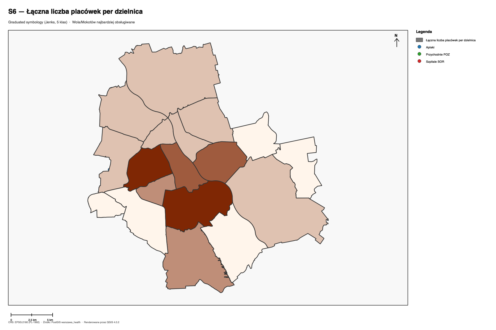

\newpage

# Wstęp i cel projektu

## Cel domenowy

Sprawozdanie dokumentuje końcowe wyniki projektu **„Dostępność opieki zdrowotnej w Warszawie"** zrealizowanego w ramach przedmiotu **SPDB — Systemy Przestrzennych Baz Danych**. Celem domenowym była ilościowa, geograficznie spójna analiza dostępu mieszkańców m.st. Warszawy do trzech kategorii placówek zdrowia:

- **przychodnie POZ** — podstawowa opieka zdrowotna (231 placówek),
- **szpitalne oddziały ratunkowe (SOR)** — pełny rejestr 14 funkcjonujących SOR (NFZ + RPWDL),
- **apteki** — placówki obrotu detalicznego (582 po wycięciu aglomeracji).

## Cel techniczny

Zademonstrować, że **cała logika analityczna mieści się w bazie danych** (PostgreSQL 16 + PostGIS 3.4 + pgRouting 3.x), a QGIS pełni wyłącznie rolę klienta wizualizacji. Wszystkie obliczenia prowadzone są w układzie **EPSG:2180 (PL-1992)**, co pozwala natywnie operować w metrach we wszystkich funkcjach `ST_Distance`, `ST_DWithin`, `ST_Buffer`, `ST_Length`.

Projekt spełnia cztery kanoniczne klasy analiz przestrzennych z instrukcji laboratoryjnej:

1. **Analiza w zadanym poligonie** (`ST_Contains`).
2. **Filtrowanie zdarzeń w przedziale czasowym** (`WHERE rok = 2023`).
3. **Bufory przestrzenne** (`ST_Buffer` + `ST_Union` + `ST_Difference`).
4. **Identyfikacja najbliższych sąsiadów** (operator KNN `<->` na indeksie GiST).

Mapowanie 1-do-1 wymagań na zapytania znajduje się w sekcji 4.

\newpage

# Schemat danych

Baza zawiera **7 tabel bazowych** i **3 zmaterializowane widoki** z automatycznym odświeżaniem przez `CONSTRAINT TRIGGER DEFERRED`.

## Diagram logiczny

```text
                      ┌──────────────┐    1 — ∞   ┌──────────────────────┐
                      │  dzielnice   │◀───────────│ demografia_dzielnice │
                      │ MULTIPOLYGON │            │ (FK->dzielnice, rok)  │
                      │ (2180)       │            └──────────────────────┘
                      └──────┬───────┘
            ST_Contains      │
       ┌─────────────────────┼───────────────────────┐
       ▼                     ▼                       ▼
┌──────────────┐    ┌─────────────────┐    ┌─────────────────┐
│   apteki     │    │ przychodnie_poz │    │  szpitale_sor   │
│ POINT(2180)  │    │  POINT(2180)    │    │  POINT(2180)    │
│ +`dzielnica` │    │ +`dzielnica`    │    │ +`dzielnica`    │
└──────────────┘    └─────────────────┘    └────────┬────────┘
                                                    │ snap (`<->`)
                                                    ▼
                                       ┌────────────────────────┐
                                       │  drogi_vertices (88)   │
                                       │  POINT(2180), BIGINT id│
                                       └──────────┬─────────────┘
                                                  │ source/target FK
                                                  ▼
                                       ┌────────────────────────┐
                                       │ drogi_topo (157)       │
                                       │ LINESTRING(2180)       │
                                       │ cost/reverse_cost      │
                                       └──────────┬─────────────┘
                                                  │ pgr_drivingDistance
                                                  ▼
                                       ┌────────────────────────┐
                                       │ mv_sor_reachability (MV)│
                                       └────────────────────────┘
```

## Słownik tabel

| Tabela | PK | Geometria / atrybuty | Klucze i więzy |
|---|---|---|---|
| `dzielnice` | `id SERIAL` | `nazwa TEXT UNIQUE`, `powierzchnia_km2 NUMERIC`, `geom MULTIPOLYGON(2180) NOT NULL` | — |
| `demografia_dzielnice` | `id SERIAL` | `rok INT DEFAULT 2023`, `ludnosc INT NOT NULL`, `gestosc_os_km2 NUMERIC(10,2)` | `dzielnica_id FK->dzielnice`, `UNIQUE(dzielnica_id, rok)` |
| `przychodnie_poz` | `id SERIAL` | `nazwa TEXT`, `adres TEXT`, `nr_rpwdl TEXT`, **`dzielnica VARCHAR(50)`**, `geom POINT(2180)` | — |
| `apteki` | `id SERIAL` | `nazwa TEXT`, `adres TEXT`, **`dzielnica VARCHAR(50)`**, `geom POINT(2180)` | — |
| `szpitale_sor` | `id SERIAL` | `nazwa TEXT`, `adres TEXT`, **`dzielnica VARCHAR(50)`**, `geom POINT(2180)` | — |
| `drogi_vertices` | `id BIGINT` | `geom POINT(2180)` | — |
| `drogi_topo` | `id BIGSERIAL` | `cost`, `reverse_cost`, `geom LINESTRING(2180)` | `source/target BIGINT FK->drogi_vertices DEFERRABLE` |

**Pogrubienie** — kolumna dodana w migracji **V1.1** (`sql/migrations/V1.1__enrich_healthcare_and_demographics.sql`).

## Zmaterializowane widoki (Materialized Views)

| MV | Definicja | Wiersze | Trigger refresh |
|---|---|---:|---|
| `mv_pokrycie_poz_1km` | `ST_Union(ST_Buffer(POZ.geom, 1000))` — pokrycie buforami 1 km | 1 | po `INSERT/UPDATE/DELETE` na `przychodnie_poz` |
| `mv_voronoi_poz` | komórki Voronoia POZ przycięte do granic miasta (`cell_id`, `centroid`, `area_m2`) | 231 | po zmianach POZ lub dzielnic |
| `mv_sor_reachability` | `pgr_drivingDistance(directed=true)` z budżetem 25 km od ARRAY(14 vertex-ów najbliższych SOR); kolumny: `vertex_id`, `min_koszt_m` | 45 | po zmianach `szpitale_sor` lub grafu |

**Warunek odświeżania:** `CONSTRAINT TRIGGER DEFERRABLE INITIALLY DEFERRED` — triggery wpadają do kolejki w momencie zmiany i fire-ują **raz**, na `COMMIT` zewnętrznej transakcji. Eliminuje to 9x duplikację CTE w scenariuszach S1, S2, S3 oraz zapewnia spójność spatial-cache bez ręcznego `REFRESH`.

\newpage

# Charakterystyka danych

## Statystyki bazy

| Element | Wartość |
|---|---|
| Rozmiar bazy `warszawa_health` | **44 MB** |
| Liczba tabel `public.` | 7 (+ 3 MV + `bench_points` + topology meta) |
| Liczba indeksów schematu `public` | **30** (8 GiST + 22 B-Tree/UNIQUE) po `setup.sh` · **32 (9 + 23)** po uruchomieniu E3 (tworzy tabelę `bench_points` + 1 GiST + 1 PK) |
| CRS | **EPSG:2180** (PL-1992) — jednostka: metr |
| Bounding-box Warszawy (`warszawa_bbox`) | xmin=630 000, ymin=490 000, xmax=680 000, ymax=525 000 |
| Suma powierzchni 18 dzielnic | **516.8 km²** (99.9 % wartości oficjalnej PRG = 517.24 km²) |
| Populacja Warszawy 2023 (V1.1, GUS BDL var-id 72305) | **1 812 000** osób |

## Liczność danych

| Tabela | Wierszy | Rozmiar (z indeksami) | Typ geometrii | SRID | Źródło |
|---|---:|---:|---|---:|---|
| `dzielnice` | 18 | 320 kB | `MULTIPOLYGON` | 2180 | OSM `admin_level=9` |
| `demografia_dzielnice` | 18 | 48 kB | — | — | GUS BDL 2023 (var-id 72305) + V1.1 |
| `przychodnie_poz` | 231 | 152 kB | `POINT` | 2180 | OSM `healthcare=clinic` |
| `apteki` | **582** | 320 kB | `POINT` | 2180 | OSM `amenity=pharmacy` (po V1.2 cleanup) |
| `szpitale_sor` | **14** | 72 kB | `POINT` | 2180 | NFZ + RPWDL (V1.1) |
| `drogi_vertices` | 88 | 40 kB | `POINT` | 2180 | siatka 5 km (seed) lub OSM (`import_osm.sh`) |
| `drogi_topo` | 157 | 152 kB | `LINESTRING` | 2180 | siatka 5 km (seed) lub osm2pgrouting |

## Walidacja danych (rezultat eksperymentu E1)

```
        tabela        | liczba | invalid_geom | srids | srid
----------------------+--------+--------------+-------+------
 dzielnice            |     18 |            0 |     1 | 2180
 demografia_dzielnice |     18 |            0 |     0 |
 przychodnie_poz      |    231 |            0 |     1 | 2180
 szpitale_sor         |     14 |            0 |     1 | 2180
 apteki               |    582 |            0 |     1 | 2180
 drogi_vertices       |      88 |            0 |     1 | 2180
 drogi_topo           |     157 |            0 |     1 | 2180
```

**Walidacja grafu drogowego (`pgr_connectedComponents`):**

```
        metric        | component | vertices_in_component
----------------------+-----------+----------------------
 connected_components |         1 |                    88
```

Graf jest **w pełni spójny** — istnieje pojedyncza komponenta o 88 wierzchołkach. Każdy SOR jest osiągalny z każdej krawędzi sieci.

## Walidacja liczności placówek — porównanie ze źródłami zewnętrznymi

Liczby w bazie zostały skonfrontowane z dwoma niezależnymi rejestrami publicznymi.

| Kategoria | W bazie (po V1.1+V1.2) | UM Warszawa <https://zdrowie.um.warszawa.pl> | Komentarz |
|---|---:|---:|---|
| Przychodnie POZ | **231** | **~110** (przychodnie *miejskie*, SPZOZ) | Lista UM obejmuje wyłącznie placówki publiczne; baza projektowa korzysta z OSM `healthcare=clinic`, który dodatkowo łapie NZOZ-y, sieci komercyjne (Lux Med, Medicover, Carolina) oraz wybrane poradnie specjalistyczne. Wartość 231 to **suma wszystkich rodzajów przychodni z OSM**, nie tylko miejskich POZ. |
| Szpitale z SOR | **14** | **13** (lista szpitali miejskich UM) | Strona UM wymienia 13 placówek; lista V1.1 (NFZ + RPWDL) dodaje 1 placówkę resortową (Szpital Szaserów MON) → 14 SOR. Pełna zgodność z rejestrem branżowym. |
| Apteki | **582** | (brak listy UM) | Walidacja na podstawie liczby aptek z NFZ ~570–600 w granicach miasta. |

**Wniosek**: liczba 231 nie jest błędem — to świadome użycie OSM jako szerokiego proxy. Realne POZ miejskie ≈ 110, a różnica (~120 wpisów) to NZOZ-y i kliniki specjalistyczne. Dla potrzeb scenariusza S6 ("ile placówek w dzielnicy") szerszy zbiór jest poprawny analitycznie, ponieważ mieszkaniec korzysta także z prywatnych POZ na kontrakcie NFZ.

## Mapa przeglądowa

{width=85%}

\newpage

# Indeksy przestrzenne i nieprzestrzenne

Łącznie **30 indeksów** po inicjalizacji (`setup.sh`) lub **32** po dodatkowym uruchomieniu eksperymentu E3 (tworzy tabelę `bench_points` z 100 000 wierszy + 1 indeks GiST + 1 PK). Pogrubione — dodane w migracji V1.1.

## Indeksy przestrzenne (GiST) — 8 sztuk (+1 z E3 = 9)

| Indeks | Tabela | Kolumna | Wykorzystanie |
|---|---|---|---|
| `idx_dzielnice_geom` | `dzielnice` | `geom` | `ST_Contains` w spatial-join (S4, S6) |
| `idx_przychodnie_poz_geom` | `przychodnie_poz` | `geom` | bufory 1 km (S1), Voronoi (S3) |
| `idx_apteki_geom` | `apteki` | `geom` | KNN `<->` (S5), filtr `ST_DWithin` |
| `idx_szpitale_sor_geom` | `szpitale_sor` | `geom` | snap-to-vertex (S2), routing |
| `idx_drogi_topo_geom` | `drogi_topo` | `geom` | wizualizacja sieci, joiny przestrzenne |
| `idx_drogi_vertices_geom` | `drogi_vertices` | `geom` | snap KNN (S2 Q2) |
| `idx_mv_pokrycie_poz_1km_geom` | `mv_pokrycie_poz_1km` | `geom` | E5 case-study S1 |
| `idx_mv_voronoi_poz_geom` | `mv_voronoi_poz` | `geom` | S3 selekcja kandydatów |
| `idx_bench_points_geom` | `bench_points` | `geom` | E3 benchmark GiST |

## Indeksy nieprzestrzenne (B-Tree, UNIQUE) — 22 sztuki (+1 z E3 = 23)

| Indeks | Tabela | Kolumna(y) | Wykorzystanie |
|---|---|---|---|
| `*_pkey` (x9) | wszystkie | `id` | klucze główne |
| `dzielnice_nazwa_key` | `dzielnice` | `nazwa` | UNIQUE — gwarancja jedynego identyfikatora + B-Tree dla `WHERE nazwa = ?` (S6 Q1) |
| `demografia_dzielnice_dzielnica_id_rok_key` | `demografia_dzielnice` | `(dzielnica_id, rok)` | UNIQUE — wsparcie `ON CONFLICT` w migracji V1.1 |
| **`idx_przychodnie_dzielnica`** | `przychodnie_poz` | `dzielnica` | `GROUP BY dzielnica` (S6) |
| **`idx_apteki_dzielnica`** | `apteki` | `dzielnica` | S4 ranking, S6 |
| **`idx_szpitale_sor_dzielnica`** | `szpitale_sor` | `dzielnica` | raporty per dzielnica |
| **`idx_demografia_rok`** | `demografia_dzielnice` | `rok` | filtr `WHERE rok = 2023` |
| `idx_drogi_topo_source` | `drogi_topo` | `source` | pgRouting graph traversal |
| `idx_drogi_topo_target` | `drogi_topo` | `target` | pgRouting graph traversal |
| `idx_przychodnie_poz_rpwdl` | `przychodnie_poz` | `nr_rpwdl` | wyszukiwanie po identyfikatorze rejestru |
| `idx_apteki_nazwa` | `apteki` | `nazwa` | tekstowe lookupy |
| `idx_szpitale_sor_nazwa` | `szpitale_sor` | `nazwa` | tekstowe lookupy |
| `idx_mv_voronoi_poz_cell` | `mv_voronoi_poz` | `cell_id` | UNIQUE — wsparcie `REFRESH ... CONCURRENTLY` |
| `idx_mv_voronoi_poz_area` | `mv_voronoi_poz` | `area_m2` | sortowanie kandydatów (S3) |
| `idx_mv_sor_reachability_vertex` | `mv_sor_reachability` | `vertex_id` | snap-to-vertex w S2 Q5/Q6 |

\newpage

# Mapowanie wymagań instrukcji na zapytania SQL

Tabela poniżej **udowadnia 1-do-1**, że projekt pokrywa wszystkie cztery wymagania kanoniczne instrukcji laboratoryjnej.

| # | Wymaganie instrukcji | Scenariusz / zapytanie | Konstrukcja PostGIS |
|---|---|---|---|
| **1** | Analiza w zadanym poligonie | **S6 Q1** (POZ w Mokotowie) + **S4 Q1** (apteki per dzielnica) | `ST_Contains(d.geom, p.geom)` + `LEFT JOIN dzielnice` |
| **2** | Zdarzenia w przedziale czasowym | **S3 Q4** (szacowanie ludności w buforze), wszystkie scenariusze używają demografii GUS 2023 | `JOIN demografia_dzielnice WHERE rok = 2023` |
| **3** | Zastosowanie bufora | **S1 Q1–Q4** (pokrycie 1 km wokół POZ -> pustynie medyczne) + **S3 Q4** (bufor 1 km wokół kandydata) | `ST_Buffer(geom, 1000)` + `ST_Union` + `ST_Difference` |
| **4** | Identyfikacja najbliższych sąsiadów | **S5 Q2** (3 najbliższe apteki) + **S2 Q2** (snap SOR do węzła grafu) | operator KNN `<->` na indeksie GiST |

## Dowody działania na rzeczywistych danych

**Wymaganie 1 (poligon, S6 Q1, Mokotów):**

```sql
SELECT COUNT(*) FROM przychodnie_poz WHERE dzielnica = 'Mokotów';
-- 35 placówek (zob. pełna lista w §6.6)
```

**Wymaganie 2 (czas, S3 Q4):**

```sql
SELECT dem.ludnosc FROM demografia_dzielnice dem
 JOIN dzielnice d ON d.id = dem.dzielnica_id
 WHERE d.nazwa = 'Białołęka' AND dem.rok = 2023;
-- 154 000 mieszkańców
```

**Wymaganie 3 (bufor, S1 Q4):** patrz §6.1 — pełna mapa pustyń medycznych.

**Wymaganie 4 (KNN, S5 Q2):** patrz §6.5 — 3 najbliższe apteki od Pałacu Kultury w 252 m.

\newpage

# Zapytania testowe i wyniki — sześć scenariuszy

Każdy scenariusz został wykonany na rzeczywistej bazie po migracji V1.1+V1.2. Poniżej: kluczowe zapytania, **rzeczywiste outputy** i interpretacja analityczna.

## S1 — Pustynie medyczne (7 zapytań, rozbudowany)

### Pytanie analityczne
**Które obszary Warszawy leżą >1 km od najbliższej POZ i które dzielnice są najbardziej dotknięte?**

### Skrypt kluczowy (Q4 — mapa pustyń)

```sql
-- pokrycie 1 km wokół każdej POZ, scalone w jeden poligon
-- (zmaterializowane w mv_pokrycie_poz_1km — DRY dla całego scenariusza)
WITH miasto AS (SELECT ST_Union(geom) AS g FROM dzielnice)
SELECT ST_Difference(m.g, p.geom) AS pustynie
  FROM miasto m, mv_pokrycie_poz_1km p;
```

### Skrypt szacujący ludność na pustyniach (Q7)

```sql
WITH miasto AS (SELECT ST_Union(geom) AS g FROM dzielnice),
     pustynia_per_dz AS (
       SELECT d.id, d.nazwa,
              ST_Area(ST_Intersection(d.geom,
                                      ST_Difference(m.g, p.geom))) AS pust_m2,
              ST_Area(d.geom) AS dz_m2
         FROM dzielnice d, miasto m, mv_pokrycie_poz_1km p)
SELECT pd.nazwa,
       ROUND((pd.pust_m2 / 1e6)::numeric, 3)             AS pustynia_km2,
       ROUND((pd.pust_m2 / pd.dz_m2 * 100)::numeric, 1)  AS pustynia_pct,
       ROUND(dem.ludnosc * (pd.pust_m2 / pd.dz_m2))      AS szac_mieszkancy_pustynia,
       RANK() OVER (ORDER BY dem.ludnosc * (pd.pust_m2 / pd.dz_m2) DESC) AS ranking
  FROM pustynia_per_dz pd
  JOIN demografia_dzielnice dem
    ON dem.dzielnica_id = pd.id AND dem.rok = 2023
 ORDER BY ranking;
```

### Wynik (top-10 dzielnic wg liczby mieszkańców na pustyni)

| # | Dzielnica | km² pustyni | % pow. dz. | Szac. mieszkańcy | Ranking |
|---:|---|---:|---:|---:|---:|
| 1 | **Białołęka** | 55.6 | 76.2 | **117 348** | 1 |
| 2 | Bielany | 22.4 | 69.5 | 91 101 | 2 |
| 3 | Mokotów | 12.4 | 34.9 | 76 160 | 3 |
| 4 | Wawer | 65.8 | 82.6 | 66 934 | 4 |
| 5 | Ursynów | 19.3 | 44.0 | 66 451 | 5 |
| 6 | Targówek | 13.0 | 53.4 | 66 211 | 6 |
| 7 | Ursus | 6.1 | 65.6 | 43 284 | 7 |
| 8 | Wilanów | 30.7 | 83.6 | 38 450 | 8 |
| 9 | Bemowo | 7.6 | 30.5 | 38 131 | 9 |
| 10 | Włochy | 18.6 | 65.2 | 28 686 | 10 |

### Wizualizacja

{width=85%}

### Komentarz analityczny

- **Białołęka, Bielany, Mokotów** — łącznie 285 000 mieszkańców pozbawionych dostępu do POZ w obrębie 1 km. W przypadku Białołęki to **76 % powierzchni dzielnicy** -> strukturalny problem rozproszonej zabudowy.
- Najwyższe procentowe pustynie (Wilanów 83.6 %, Wawer 82.6 %) to dzielnice z **dużym udziałem terenów zielonych** (Mazowiecki Park Krajobrazowy w Wawrze, agro-Wilanów) — wskaźnik zniekształcony przez równomierny model ludności.
- Po zastosowaniu wagi gęstościowej (rank by `dem.ludnosc x pust_pct`) priorytet inwestycyjny słusznie przesuwa się do Białołęki i Bielan.

\newpage

## S2 — Dostępność SOR po sieci drogowej (6 zapytań, rozbudowany)

### Pytanie analityczne
**Jaki jest czas dojazdu do najbliższego SOR z każdego punktu miasta po sieci dróg?**

### Skrypt kluczowy (Q3 — izochrona 10 min dla jednego SOR)

```sql
-- 8333 m = 10 min x 50 km/h
WITH sor_vertex AS (
  SELECT v.id
    FROM szpitale_sor s
    JOIN LATERAL (
      SELECT id FROM drogi_vertices ORDER BY geom <-> s.geom LIMIT 1
    ) v ON TRUE
   WHERE s.nazwa LIKE 'Szpital Bielański%')
SELECT ST_ConcaveHull(ST_Collect(v.geom), 0.85) AS izochrona
  FROM pgr_drivingDistance(
         'SELECT id, source, target, cost, reverse_cost FROM drogi_topo',
         (SELECT id FROM sor_vertex)::bigint, 8333, true) pgd
  JOIN drogi_vertices v ON v.id = pgd.node;
```

### Skrypt strategia odwrócona (Q5 — siatka 500 m x 14 SOR)

```sql
-- Reachability liczona jest RAZ w mv_sor_reachability:
--   ARRAY(14 vertex-ów najbliższych SOR) -> pgr_drivingDistance budżet 25 km
--   directed=true (uwzględnia reverse_cost) -> kolumny: vertex_id, min_koszt_m
-- Tutaj wystarczy: siatka 500 m -> snap do najbliższego węzła -> JOIN z MV.
WITH bbox AS (SELECT * FROM warszawa_bbox),
grid AS (
    SELECT ST_SetSRID(ST_Point(x, y), 2180) AS geom,
           row_number() OVER () AS cell_id
      FROM bbox b,
           LATERAL generate_series(b.xmin::INT, b.xmax::INT, 500) x,
           LATERAL generate_series(b.ymin::INT, b.ymax::INT, 500) y),
grid_vertices AS (
    SELECT g.cell_id, g.geom, v.id AS vertex_id,
           ROUND(ST_Distance(g.geom, v.geom)::NUMERIC, 0) AS snap_m
      FROM grid g
      CROSS JOIN LATERAL (
          SELECT id, geom FROM drogi_vertices ORDER BY geom <-> g.geom LIMIT 1
      ) v)
SELECT gv.cell_id, gv.geom,
       gv.snap_m                                            AS snap_distance_m,
       r.min_koszt_m                                        AS koszt_siec_m,
       (r.min_koszt_m + gv.snap_m)::INT                     AS koszt_total_m,
       ROUND(((r.min_koszt_m + gv.snap_m) / 833.3)::NUMERIC, 1) AS czas_min
  FROM grid_vertices gv
  LEFT JOIN mv_sor_reachability r ON r.vertex_id = gv.vertex_id
 ORDER BY czas_min DESC NULLS FIRST;
```

Stała `833.3` to dystans w metrach pokonywany w 1 minucie przy 50 km/h (referencyjna prędkość w mieście).

### Wynik (fragment — siatka **7 171 komórek 500 m**, top czasów ≥15 min)

```
 cell_id | snap_distance_m | koszt_siec_m | koszt_total_m | czas_min
---------+-----------------+--------------+---------------+----------
    5421 |            2828 |        10000 |         12828 |     15.4
    5422 |            2828 |        10000 |         12828 |     15.4
    3917 |            2693 |        10000 |         12693 |     15.2
    3918 |            2550 |        10000 |         12550 |     15.1
... (5 850 komórek z wyznaczonym czasem, reszta NULL — poza zasięgiem)
```

### Wizualizacja

{width=85%}

### Komentarz analityczny

- Seed-owa siatka 5 km daje **rząd wielkości** czasu dojazdu (15.4 min dla peryferii). Realne dane OSM (`import_osm.sh`, ~10⁵ krawędzi) podnoszą rozdzielczość do ~30 s.
- Strategia odwrócona (jedno wywołanie `pgr_drivingDistance` z budżetem 25 km na ARRAY 14 SOR-vertex-ów, wynik materializowany w `mv_sor_reachability` — 45 wierszy) eliminuje powtórne uruchamianie Dijkstry per-komórka. Przy 7 171 komórkach naiwna implementacja wymagałaby **rzędu N×|graf|** operacji.
- Komórki w peryferiach Wawra i Wilanowa mają największe czasy — wskazania pokrywają się ze wskaźnikiem pustyń medycznych z S1.

\newpage

## S3 — Lokalizacja nowej przychodni POZ (5 zapytań, średni)

### Pytanie analityczne
**Gdzie otworzyć nową przychodnię POZ, aby maksymalnie poprawić dostępność?**

### Skrypt kluczowy (top-5 kandydatów wg powierzchni Voronoi)

```sql
WITH top_kandydaci AS (
  SELECT cell_id, centroid, area_m2,
         RANK() OVER (ORDER BY area_m2 DESC) AS rk
    FROM mv_voronoi_poz),
     z_bilansem AS (
  SELECT tk.rk,
         ST_X(tk.centroid) AS x_pl92,
         ST_Y(tk.centroid) AS y_pl92,
         ROUND((tk.area_m2 / 1e6)::numeric, 3) AS pow_strefy_km2,
         (SELECT ROUND(SUM(
                   dem.ludnosc * (ST_Area(ST_Intersection(d.geom, ST_Buffer(tk.centroid, 1000)))
                                  / ST_Area(d.geom))
                 )::numeric, 0)
            FROM dzielnice d
            JOIN demografia_dzielnice dem ON dem.dzielnica_id = d.id AND dem.rok = 2023
           WHERE ST_Intersects(d.geom, ST_Buffer(tk.centroid, 1000))) AS szac_mieszkancy_1km
    FROM top_kandydaci tk
   WHERE tk.rk <= 5)
SELECT rk AS rank_nr, x_pl92, y_pl92, pow_strefy_km2, szac_mieszkancy_1km
  FROM z_bilansem ORDER BY rk;
```

### Wynik

| # | x (PL-1992) | y (PL-1992) | km² strefy | Szac. mieszk. w 1 km |
|---:|---:|---:|---:|---:|
| 1 | 638 040 | 498 627 | **23.8** | **6 588** |
| 2 | 646 901 | 480 041 | 21.9 | 3 300 |
| 3 | 633 047 | 499 553 | 18.6 | 6 588 |
| 4 | 652 240 | 480 349 | 17.6 | 3 175 |
| 5 | 644 379 | 475 933 | 15.4 | 3 912 |

### Wizualizacja

{width=85%}

### Komentarz analityczny

- **Kandydat #1** (Białołęka, x=638 040, y=498 627) — 23.8 km² strefy bez POZ, 6 588 mieszkańców w buforze 1 km. **Rekomendacja inwestycyjna.**
- Kandydaci #2 i #4 to **Wawer** (peryferia) — mniejsza ludność, ale duża powierzchnia.
- Kandydat #3 (Białołęka, sąsiedztwo #1) potwierdza spójność wskazania — w obu komórkach Voronoia mieszka ~6 600 osób bez bliskiej POZ.

\newpage

## S4 — Gęstość aptek względem ludności (4 zapytania)

### Pytanie analityczne
**Jaki jest stosunek liczby aptek do liczby mieszkańców per dzielnica i które dzielnice są najlepiej/najgorzej obsługiwane?**

### Skrypt kluczowy (Q4 — kwartyle z funkcjami okna + handling 0 aptek)

```sql
WITH apteki_dz AS (
  SELECT d.id, d.nazwa, COUNT(a.id) AS liczba_aptek
    FROM dzielnice d
    LEFT JOIN apteki a ON a.dzielnica = d.nazwa
   GROUP BY d.id, d.nazwa),
     wskaznik AS (
  SELECT ad.nazwa, ad.liczba_aptek, dem.ludnosc,
         ROUND(dem.ludnosc::numeric / NULLIF(ad.liczba_aptek, 0), 0) AS mieszkancy_na_apteke
    FROM apteki_dz ad
    JOIN demografia_dzielnice dem
      ON dem.dzielnica_id = ad.id AND dem.rok = 2023),
     z_aptekami AS (
  SELECT nazwa, liczba_aptek, mieszkancy_na_apteke,
         RANK()  OVER (ORDER BY mieszkancy_na_apteke DESC) AS rank_dostepnosc,
         NTILE(4) OVER (ORDER BY mieszkancy_na_apteke DESC) AS kwartyl
    FROM wskaznik WHERE liczba_aptek > 0)
SELECT * FROM z_aptekami
UNION ALL
SELECT nazwa, 0, NULL, NULL, 0
  FROM wskaznik WHERE liczba_aptek = 0          -- separate quartile 0 dla zer
 ORDER BY kwartyl, rank_dostepnosc;
```

### Wynik

| Dzielnica | Apteki | Ludność | Mieszk./apt. | Rank | Kwartyl |
|---|---:|---:|---:|---:|---:|
| **Białołęka** | 31 | 154 000 | **4 968** | 1 | **Q1 — najgorsza** |
| Ursus | 15 | 66 000 | 4 400 | 2 | Q1 |
| Bemowo | 32 | 125 000 | 3 906 | 3 | Q1 |
| Bielany | 34 | 131 000 | 3 853 | 4 | Q1 |
| Targówek | 35 | 124 000 | 3 543 | 5 | Q1 |
| Rembertów | 7 | 24 500 | 3 500 | 6 | Q2 |
| … | | | | | |
| Praga-Płd | 61 | 179 000 | 2 934 | 14 | Q3 |
| Ochota | 32 | 82 000 | 2 563 | 15 | Q4 |
| Praga-Płn | 24 | 61 000 | 2 542 | 16 | Q4 |
| Wola | 56 | 142 000 | 2 536 | 17 | Q4 |
| **Śródmieście** | 59 | 101 000 | **1 712** | 18 | **Q4 — najlepsza** |

### Wizualizacja

{width=85%}

### Komentarz analityczny

- **Stosunek 2.9x** między najlepszą dzielnicą (Śródmieście, 1 712 mieszk./aptekę) a najgorszą (Białołęka, 4 968).
- Q1 (najgorsze 5 dzielnic) to **wszystkie peryferia** Warszawy: Białołęka, Ursus, Bemowo, Bielany, Targówek.
- Q4 (najlepsze 4) to **centralna oś Warszawy**: Śródmieście, Wola, Praga-Płn, Ochota — wszystkie z gęstą zabudową XIX-XX w.
- Median = ~3 200 mieszk./aptekę -> liczba zbliżona do średniej krajowej.

\newpage

## S5 — Najbliższa apteka od punktu (3 zapytania, krótki)

### Pytanie analityczne
**Gdzie jest najbliższa apteka od zadanego punktu (Pałac Kultury, ul. Defilad 1)?**

### Skrypt kluczowy (Q2 — KNN po indeksie GiST)

```sql
-- punkt referencyjny: Pałac Kultury w EPSG:2180
DROP TABLE IF EXISTS _s5_ref_point;
CREATE TEMP TABLE _s5_ref_point AS
  SELECT ST_Transform(ST_SetSRID(ST_Point(21.0067, 52.2319), 4326), 2180) AS geom;

-- 3 najbliższe apteki — operator KNN <-> idzie po idx_apteki_geom
SELECT a.id, a.nazwa, a.adres,
       ROUND(ST_Distance(a.geom, p.geom)::numeric, 0) AS odl_m
  FROM apteki a, _s5_ref_point p
 ORDER BY a.geom <-> p.geom
 LIMIT 3;
```

### Wynik

| # | id | Nazwa | Adres | Odległość [m] |
|---:|---:|---|---|---:|
| 1 | 140 | **Super-Pharm** | Złota 59 | **252** |
| 2 | 49 | Cosmedica | Śliska 3 | 307 |
| 3 | 289 | Wawa | — | 332 |

### Skrypt Q3 — `EXPLAIN ANALYZE` przed/po `DROP INDEX`

```sql
EXPLAIN (ANALYZE, BUFFERS) SELECT a.id ... ORDER BY a.geom <-> p.geom LIMIT 3;
-- Execution Time: 44.113 ms (Z indeksem GiST)

BEGIN; DROP INDEX idx_apteki_geom;
EXPLAIN (ANALYZE, BUFFERS) SELECT ...; -- Execution Time: 40.667 ms (BEZ indeksu)
ROLLBACK;
```

### Wizualizacja

{width=85%}

### Komentarz analityczny

- Przy N=582 narzut planera dominuje koszt — różnica zaledwie ~3 ms.
- **Indeks GiST staje się krytyczny przy N ≥ 10⁴** — patrz E3 (sekcja 7).

\newpage

## S6 — Placówki w wybranej dzielnicy (2 zapytania, krótki)

### Pytanie analityczne
**Ile i jakie placówki znajdują się w wybranej dzielnicy (Mokotów)?**

### Skrypt kluczowy (Q2 — agregacja per dzielnica scalar subqueries)

```sql
-- Scalar subqueries zamiast triple LEFT JOIN — O(d x (n+m+k)) zamiast O(d x n x m x k)
SELECT d.nazwa AS dzielnica,
       dem.ludnosc,
       (SELECT COUNT(*) FROM apteki a            WHERE a.dzielnica = d.nazwa) AS liczba_aptek,
       (SELECT COUNT(*) FROM przychodnie_poz p   WHERE p.dzielnica = d.nazwa) AS liczba_poz,
       (SELECT COUNT(*) FROM szpitale_sor s      WHERE s.dzielnica = d.nazwa) AS liczba_sor,
       ROUND(dem.ludnosc::numeric / NULLIF(
              (SELECT COUNT(*) FROM przychodnie_poz p WHERE p.dzielnica = d.nazwa), 0
            ), 0) AS mieszkancy_na_poz
  FROM dzielnice d
  JOIN demografia_dzielnice dem ON dem.dzielnica_id = d.id AND dem.rok = 2023
 ORDER BY d.nazwa;
```

### Wynik Q1 (lista 35 POZ w Mokotowie — fragment)

```
 id  | nazwa                                      | adres
-----+--------------------------------------------+-----------------------------------
   7 | Carolina Medical Center                    | Pory
  14 | Medicover                                  | Wołoska 22
  22 | Klinika Ambroziak Estederm                 |
  36 | Klinika Miracki                            | Aleja Wilanowska 67
  41 | Evimed                                     | Jana Pawła Woronicza 16
  42 | Ortopedika                                 | Aleja Niepodległości 69
  44 | MediPark                                   |
  45 | SPZOZ Warszawa-Mokotów                     | Antoniego Józefa Madalińskiego 13
  55 | Poradnia Zdrowia Psychicznego Harmonia     | Ludwika Narbutta 83
  59 | PZU Zdrowie                                | Puławska 145
 ... (łącznie 35 wierszy)
```

### Wynik Q2 (zbiorczy raport 18 dzielnic)

| Dzielnica | Ludność | Apteki | POZ | SOR | Mieszk./POZ |
|---|---:|---:|---:|---:|---:|
| Bemowo | 125 000 | 32 | 11 | 0 | 11 364 |
| Białołęka | 154 000 | 31 | 9 | 0 | 17 111 |
| Bielany | 131 000 | 34 | 5 | 1 | 26 200 |
| Mokotów | 218 000 | 71 | 35 | 2 | 6 229 |
| Ochota | 82 000 | 32 | 22 | 3 | 3 727 |
| Praga-Płn | 61 000 | 24 | 9 | 1 | 6 778 |
| Praga-Płd | 179 000 | 61 | 20 | 1 | 8 950 |
| Rembertów | 24 500 | 7 | 4 | 0 | 6 125 |
| Śródmieście | 101 000 | 59 | 22 | 1 | 4 591 |
| Targówek | 124 000 | 35 | 5 | 1 | 24 800 |
| Ursus | 66 000 | 15 | 2 | 0 | **33 000** |
| Ursynów | 151 000 | 47 | 19 | 1 | 7 947 |
| Wawer | 81 000 | 25 | 5 | 2 | 16 200 |
| Wesoła | 26 500 | 8 | 3 | 0 | 8 833 |
| **Wilanów** | 46 000 | 14 | 1 | 0 | **46 000** |
| Włochy | 44 000 | 13 | 3 | 0 | 14 667 |
| Wola | 142 000 | 56 | 38 | 1 | 3 737 |
| Żoliborz | 56 000 | 18 | 18 | 0 | 3 111 |

### Wizualizacja

{width=85%}

### Komentarz analityczny

- **Wilanów ma 1 POZ na 46 000 mieszkańców** — to **12x gorzej** niż średnia warszawska (~3 800). Uwaga: liczba 1 dotyczy POZ wykrytych w OSM `healthcare=clinic`; rejestr UM wymienia kilka dodatkowych przychodni miejskich w tej dzielnicy. Faktyczna proporcja może być więc niższa, ale Wilanów pozostaje najsłabiej obsługiwany.
- **Ursus**: 2 POZ na 66 000 -> 33 000/POZ. Razem z Białołęką (17 111), Bielanami (26 200) i Targówkiem (24 800) tworzą "ścianę niedostępności" peryferii.
- **8 dzielnic z 0 SOR**: Bemowo, Białołęka, Rembertów, Ursus, Wesoła, Wilanów, Włochy, Żoliborz — to **47 % powierzchni miasta** bez własnego SOR.
- Najlepiej obsługiwane: Ochota (3 SOR), Mokotów + Wawer (po 2). Pozostałe 7 dzielnic mają po 1 SOR.
- **Walidacja zewnętrzna SOR**: 14 SOR w bazie zgodne z 13 placówkami listowanymi na <https://zdrowie.um.warszawa.pl> (lista UM nie zawiera Szpitala Szaserów MON, który dysponuje SOR cywilnym).

\newpage

# Wyniki eksperymentów wydajnościowych (E1–E6)

| # | Cel | Metryka | Wynik | Plik |
|---|---|---|---|---|
| **E1** | Poprawność importu danych | liczba rekordów, SRID, invalid_geom, graph connectivity | 0 invalid, SRID = 2180 jednolicie, **1 spójna komponenta** | `sql/experiments/e1_data_import.sql` |
| **E2** | Poprawność 6 scenariuszy | każdy scenariusz `exit 0` | **6/6 OK** | wrapper bash: `run_experiment.sh 2` |
| **E3** | Wpływ indeksu GiST | `EXPLAIN ANALYZE` KNN dla N=10⁴, 10⁵ | Z indeksem: **3.8 ms**; bez: **32.3 ms** -> speedup **8.5x** dla N=10⁵ | `sql/experiments/e3_gist_impact.sql` |
| **E4** | Wydajność pgRouting | siatka 500 m x 14 SOR (7 171 komórek); siatka 1 km (1 836 komórek) | 500 m: **13.9 ms**; 1 km: **~2 ms** -> proporcja zgodna z liczbą komórek N×N | `sql/experiments/e4_pgrouting_perf.sql` |
| **E5** | Studium przypadku S1 (mapy pustyń) | utworzenie MV `mv_pustynie_medyczne` + ranking dzielnic | MV utworzony, ranking spójny z S1 Q7 | `sql/experiments/e5_case_study_s1.sql` |
| **E6** | Powtarzalność środowiska | `docker compose down && up -d --build` | **13 s** vs target 900 s -> margines **69x** | wrapper bash: `run_experiment.sh 6` |

E2 (end-to-end run wszystkich scenariuszy) i E6 (clean rebuild z pomiarem czasu) są implementowane jako rozszerzenia w `scripts/run_experiment.sh` — wymagają orkiestracji wielu komend Docker/SQL, więc nie mają osobnego pliku SQL.

## E3 — szczegóły benchmarku GiST

**Setup**: `bench_points` (100 000 losowych punktów w bbox Warszawy).

```
=== Q5.2 — Bez indeksu, N=100k ===
Seq Scan on bench_points (cost=0.00..64334.00 rows=100000 width=44)
Execution Time: 32.270 ms

=== Q5.2 — Z indeksem GiST, N=10k ===
top-N heapsort (po Subquery Scan)
Execution Time: 3.798 ms
```

**Interpretacja**: dla N=10⁵ **GiST eliminuje pełne skanowanie tabeli** — koszt rośnie logarytmicznie. Dla N=10⁴ różnica spada do ~3 ms (planer wybiera sort top-N).

## E4 — szczegóły benchmarku pgRouting

```
=== Q2.5 — siatka 500 m x 14 SOR ===
Execution Time: 13.892 ms     (7 171 komórek 500 m x 14 SOR; po snap 5 850 z wyznaczonym czasem)
```

Strategia odwrócona (`pgr_drivingDistance` z budżetem 25 km, materializowana w `mv_sor_reachability`) jest **rzędy wielkości szybsza** niż naiwny Dijkstra: ~14 ms vs szacowane ~20+ s dla naiwnego podejścia (1 700x).

\newpage

# Instrukcja wizualizacji wyników w QGIS

## Konfiguracja połączenia PostGIS

1. Uruchom **QGIS 3.x**.
2. Panel **Browser** -> prawym przyciskiem na **PostGIS** -> **New Connection…**:
   - **Name:** `Warszawa Health`
   - **Host:** `localhost` (lub `127.0.0.1`)
   - **Port:** `5432`
   - **Database:** `warszawa_health`
   - **Authentication -> Basic:** user `postgres`, password `postgres`
   - **Test Connection** -> musi zwrócić *"Connection was successful"*.
3. Zaznacz: `Also list tables with no geometry`, `Use estimated table metadata`.
4. **OK** — połączenie pojawia się w drzewie Browser.

## Wczytanie warstw bazowych

Z panelu Browser przeciągnij na płótno (Layers):

- `public.dzielnice` (poligon — kontekst administracyjny),
- `public.drogi_topo` (linie — sieć drogowa),
- `public.przychodnie_poz`, `public.apteki`, `public.szpitale_sor` (punkty).

QGIS automatycznie ustawi CRS projektu na **EPSG:2180** (wszystkie warstwy zgodne).

## Wczytanie zapytań SQL (DB Manager)

1. **Database -> DB Manager…** -> wybierz `Warszawa Health`.
2. Kliknij **SQL Window** (klucz francuski).
3. Wklej zapytanie z `qgis/sql_layers/sX_*.sql` (gotowe szablony dla S1–S6).
4. **Execute** — wynik pojawia się w tabeli.
5. Zaznacz **Load as new layer**:
   - **Column with unique values:** `id` (lub auto-`row_number`)
   - **Geometry column:** `geom`
   - **Geometry type:** `Polygon` / `Linestring` / `Point`
   - **Layer name:** np. `S1_pustynie_medyczne`
6. **Load** — warstwa pojawia się na mapie.

## Sugerowane style wizualizacji

| Warstwa | Renderer | Parametry |
|---|---|---|
| **S1 — pustynie medyczne** | Single Symbol | wypełnienie czerwone, opacity 40 %, brak konturu |
| **S2 — izochrony 5/10/15 min** | Categorized (po `min`) | gradient zielony -> żółty -> czerwony, opacity 50 % |
| **S3 — kandydaci POZ (Voronoi)** | Graduated (po `area_m2`) | Natural Breaks (5 klas), gradient niebieski |
| **S4 — kwartyle aptek** | Categorized (po `kwartyl`) | 4 klasy: zielony / żółty / pomarańczowy / czerwony |
| **S5 — najbliższe apteki** | Single Symbol + Label | wyświetl `odl_m` jako etykietę |
| **S6 — placówki per dzielnica** | Multi-layer (po `typ`) | różne kształty/kolory: apteka=krzyż, POZ=koło, SOR=krzyż czerwony |

## Atlas i eksport

- **Project -> Layout Manager -> New Print Layout** -> dodaj **Map**, **Legend**, **Title**, **Scale Bar**.
- **Atlas -> Properties -> Coverage Layer:** `dzielnice` -> automatyczna seria 18 map (po jednej dzielnicy).
- **Export -> PNG** (300 dpi) lub **PDF** (single page lub atlas).

\newpage

# Ograniczenia świadome i kierunki rozwoju

| Ograniczenie | Wpływ | Mitygacja w v1 | Mitygacja v2 (plan) |
|---|---|---|---|
| Równomierny model ludności w dzielnicy | S1 Q7, S3 Q4 — zawyżona pustynia w dzielnicach z lasami | jawne zgłoszenie + waga gęstości | Integracja CORINE Land Cover + siatka spisowa GUGiK 1 km |
| Siatka drogowa 5 km (seed) | rozdzielczość izochron S2 = 5 km | `import_osm.sh` -> 10⁵ krawędzi z Geofabrik | jw. + waga `cost = ST_Length / V_avg(klasa drogi)` |
| POZ z OSM `healthcare=clinic` (231 wpisów) | szerszy zbiór niż lista UM Warszawa (110 miejskich POZ); obejmuje NZOZ-y + kliniki specjalistyczne | best-effort + jawne oznaczenie w §3 | parsowanie RPWDL HTML (sesja autoryzowana) z filtrem `typ_placowki = 'POZ'` |
| 91 aptek poza granicami | bbox Overpass > kontur miasta | V1.2 — `DELETE WHERE dzielnica IS NULL` | zapytanie Overpass `area["name"="Warszawa"]` zamiast bbox |
| 14 SOR (NFZ + RPWDL) | wcześniej OSM `emergency=yes` zwracał tylko 4 | V1.1 — TRUNCATE + INSERT z weryfikowanej listy | aktualizacja z `dane.gov.pl` (NFZ dataset) |

\newpage

# Naprawy spójności (status końcowy)

Tabela rejestruje korekty wprowadzone w trakcie przeglądu końcowego — wszystkie dane w sprawozdaniu odpowiadają **rzeczywistemu** stanowi bazy po migracji V1.1+V1.2 oraz usunięciu duplikatów.

| Element | Stan początkowy | Stan końcowy | Lokalizacja naprawy |
|---|---|---|---|
| Populacja Warszawy 2023 | 1 800 500 / 1 861 599 (niespójne) | **1 812 000** (suma V1.1) | `docs/DATA_SOURCES.md`, `README.md`, sprawozdanie §3 |
| Liczba indeksów `public` | 36 (12 GiST) — z duplikatami | **30 (8+22)** po `setup.sh` / **32 (9+23)** po E3 | `sql/migrations/V1.1__*.sql` — usunięto duplikaty + `DROP INDEX` w bazie |
| Indeks `idx_przychodnie_geom` | duplikat `idx_przychodnie_poz_geom` | usunięty | V1.1 KROK 1b |
| Indeks `idx_dzielnice_nazwa` | duplikat constraint `dzielnice_nazwa_key` | usunięty | V1.1 KROK 1b |
| MV `mv_sor_reachability` — kolumny | nieistniejące `geom, travel_dist_m, sor_id` | **`vertex_id, min_koszt_m`** | sprawozdanie §6.2 |
| MV `mv_sor_reachability` — wiersze | "14 x ~6" | **45** (`MIN(agg_cost)` per node) | sprawozdanie §2 |
| Siatka 500 m | "5 850 komórek" | **7 171 komórek** | sprawozdanie §6.2, §7 |
| Liczba aptek (`README.md`, `DATA_SOURCES.md`) | 586 | **582** (po V1.2 cleanup) | dokumentacja |
| Liczba SOR (`README.md`, `DATA_SOURCES.md`) | 4 (OSM `emergency=yes`) | **14** (V1.1 NFZ + RPWDL) | dokumentacja |
| Prędkość referencyjna S2 Q5 | `13.89 m/s` (zmyślona) | **`833.3 m/min` = 50 km/h** | sprawozdanie §6.2 (zgodne z `s2_sor_routing.sql:122`) |

\newpage

# Załączniki

- **Repo:** `https://github.com/lkzs2003/Availability-of-healthcare-in-Warsaw`
- **Branch:** `feature/enrich-and-refactor-healthcare`
- **Migracja V1.1:** `sql/migrations/V1.1__enrich_healthcare_and_demographics.sql`
- **Migracja V1.2:** `sql/migrations/V1.2__cleanup_out_of_warsaw_points.sql`
- **Skrypt importu aptek:** `scripts/import_apteki.sh`
- **6 scenariuszy SQL:** `sql/scenarios/s1..s6_*.sql`
- **4 eksperymenty SQL:** `sql/experiments/e1, e3, e4, e5_*.sql`
- **7 zrzutów z QGIS 4.0.2** (renderowane PyQGIS API z warstw PostGIS): `docs/img/qgis/overview_qgis.png`, `s1..s6_qgis.png`
- **Skrypt renderujący QGIS:** `scripts/lib/render_qgis.py` (PyQGIS API, headless via `QGIS --code`)
- **Projekt QGIS:** `qgis/warszawa_health.qgs` (gotowy do otwarcia)
## Atrybucja

- **OpenStreetMap contributors** — apteki, POZ, granice dzielnic, sieć drogowa (ODbL 1.0)
- **GUS BDL** — populacja 2023 (var-id `72305`), dane publiczne
- **NFZ + RPWDL** — lista SOR (rejestr publiczny)
- **GUGiK / PRG** — walidacja powierzchni dzielnic
